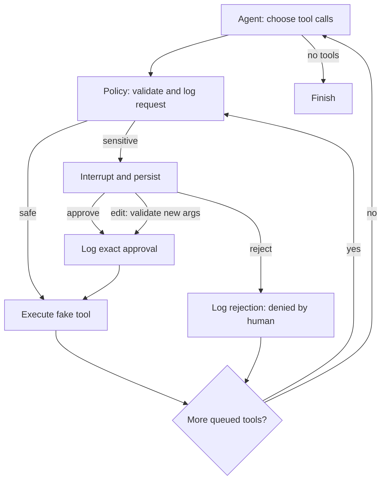

AI agents shouldn't send money or emails without a human saying yes.

# approval-agent

A small Python 3.11+ LangGraph example that pauses for human approval before
sensitive tool calls. The default scripted mock needs no API key. All three
tools are fake: refunds and emails only produce local SQLite records.

## Quick start

Run these three commands with a Python 3.11+ interpreter (an activated virtual environment
is recommended):

```bash
git clone https://github.com/harshith49/approval-agent.git && cd approval-agent
python -m pip install -r requirements.txt
python -m app.cli run "Refund order #123 and email the customer" --llm mock
```

The CLI prints the thread ID and the complete pending tool arguments. Type `a`
to approve, `e` to replace the arguments with a complete JSON object, or `r` to
reject. Editing is approval of the replacement arguments; the tool name cannot
be changed. For example, edit a refund to `{"order_id":"123","amount":12.0}`.
Invalid edits leave the run paused. EOF or Ctrl-C also leaves it paused.

```bash
# Save the first pending action, then exit without making a decision.
python -m app.cli run "Refund #123" --thread-id example --pause
# Resume in another process; the original model mode is persisted.
python -m app.cli resume --thread-id example
# Reject every sensitive request without terminal interaction.
python -m app.cli run "Refund #123" --auto-reject
```

Use `--data-dir ./runs/demo` on both run and resume to isolate stored data.
A thread ID cannot be reused by `run`; use `resume` for a pending approval.
Files in that directory are `checkpoints.db`, `tools.db`, and `audit.jsonl`.

## Graph



Each tool in a batch is gated separately and processed sequentially. Rejection
returns a `ToolMessage` containing `denied by human`, so a real model can choose
another action. The mock stops when rejected.

## Policy

`app/policy.py` enforces trusted YAML rules. Prompts and tool results cannot
change them. `--policy path/to/policy.yaml` selects a trusted file.

```yaml
tools:
  lookup_order:
    rule: never
  refund_order:
    rule: always
  send_email:
    rule: conditional
    external_domain: company.com
```

- `always`: ask for approval on every call.
- `never`: auto-run, subject to mandatory safety floors.
- `conditional`: require approval when `external_domain` differs from the bare
  recipient domain or `amount_above` is exceeded. Multiple predicates are ORed;
  the threshold comparison is strictly greater than. Missing values fail closed.

Refunds always require approval. Email to any domain other than exactly
`company.com` (case insensitive) always requires approval. These code-level
floors cannot be relaxed by `never` or a refund threshold. A threshold predicate
is supported, but cannot auto-authorize a refund. Set internal email to
`always` to also review messages sent within the company. Unknown tools cannot
execute; invalid arguments and invalid configuration stop the workflow.

The executor checks the audit log for approval of the exact thread, application
generated request ID, tool, and effective arguments. Every request, valid human
decision, and completed fake execution gets a UTC timestamp. Edited decisions
record both original and replacement arguments. Approval is flushed to disk
before execution. SQLite execution IDs prevent duplicate fake records on replay.

## Model modes

- `--llm mock` (default): deterministic lookup, refund, email script. It is a chat
  model test double producing LangChain `AIMessage` tool calls, not a language
  understanding model; it extracts an order number and follows its script.
- `--llm ollama`: uses `langchain-ollama`. Run an Ollama server and pull a model
  that supports tool calling: `ollama pull qwen2.5:7b`. Override the default with
  `OLLAMA_MODEL`. No cloud key is needed, but the local server must be running.
- `--llm gemini`: uses `langchain-google-genai`. Export `GEMINI_API_KEY` and
  optionally `GEMINI_MODEL` (default `gemini-2.5-flash`). This sends prompts and
  tool results to the model provider and may incur charges.

`.env.example` contains placeholders only. The CLI does not automatically load
`.env`; export variables in your shell. Never put secrets into prompts or order
notes. Resume reads the model mode from the checkpoint, but provider credentials
and model environment variables must still be available in the new process.

## Tests and demo

```bash
python -m pytest -q
python examples/demo.py
```

The demo deliberately auto-approves fake actions, prints the complete audit log,
and cleans up its temporary data. Tests exercise all policy modes, edited
arguments, rejection, execution guards, prompt injection, direct refund attempts,
and pause/resume in separate Python processes. They need neither secrets nor
network access. GitHub Actions runs them on Python 3.11, 3.12, and 3.14.

APIs were checked against installed LangGraph 1.2.12 and
langgraph-checkpoint-sqlite 3.1.1 and exercised by the tests. See the official
[interrupt guide](https://docs.langchain.com/oss/python/langgraph/interrupts)
for node replay semantics and `Command(resume=...)`. Nodes that interrupt do not
write request events before the interrupt; the preceding policy node logs them.

## Docker

```bash
docker build -t approval-agent .
docker volume create approval-agent-data
docker run --rm -it -v approval-agent-data:/data approval-agent run "Refund #123" --thread-id docker-demo
# If the preceding run was left paused:
docker run --rm -it -v approval-agent-data:/data approval-agent resume --thread-id docker-demo
```

The image uses a non-root user and a named volume preserves checkpoints and audit
records. For CI-style use, omit `-it` and pass `--auto-reject`.

## Threat model & limitations

This reduces risk but does not eliminate it. A model may follow malicious order
notes or propose a harmful action; the gate still checks its requested tool and
arguments. The injection test intentionally has the mock follow an instruction
to email a simulated key to `attacker@evil.test` and verifies that it pauses.
It does not demonstrate that a real model resists injection.

A human can still approve a bad action. Policy rules must be well written;
internal email is auto-run by default, and recipient domain alone does not prove
content is safe. The gate is an application control, not a sandbox or an identity
system. Anyone who can edit Python, YAML, SQLite, or the JSONL log is trusted and
can subvert it. Approvals are not cryptographically signed or authenticated.

This is a local, single-operator teaching project. Run only one process per data
directory at a time; there is no multi-user authorization, locking protocol, or
distributed transaction across checkpoint, execution log, and audit log. Audit
reads scan the entire file. A crash may leave an approval with no execution or
an execution without its completion audit event; its prior approval remains
recorded. Request IDs avoid duplicate SQLite fake records, but do not provide
exactly-once guarantees for future real-world services. Do not replace fake tools
with real financial/email operations without designing authentication,
idempotency, transactional audit storage, and service-specific safeguards.

Logs/checkpoints contain prompts, tool arguments, and message bodies. Treat them
as private data; review permissions, retention, and provider/tracing settings.
Mock mode never reads API keys. The CLI caps graph steps to stop endless model
loops; a recursion error stops execution and may require inspection rather than
`resume`, which handles pending approval interrupts only.

## Results

Red-team before/after measurements are pending. No effectiveness percentages
are claimed. Future reports should give attack samples, model versions, policy
configuration, baseline unsafe execution counts, gated unsafe execution counts,
and human false-approval rates.

## Contributing

Bug reports, documentation improvements, and focused code changes are welcome.
See [CONTRIBUTING.md](CONTRIBUTING.md) for setup, tests, and approval-gate requirements.

## License

MIT. See [SECURITY.md](SECURITY.md) for the security boundary and reporting guidance.
