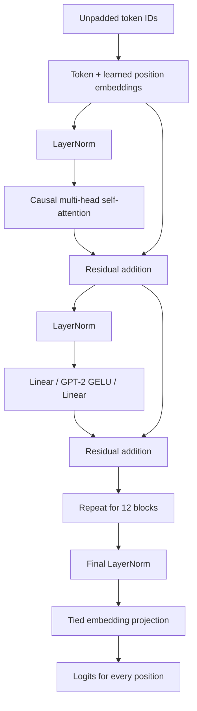

# Baseline architecture

The Milestone 1 engine implements GPT-2 small using PyTorch tensors and modules. Hugging Face is the loading and correctness boundary, not the inference runtime.



Each attention head computes `softmax(QKᵀ / sqrt(head_dim))V`. Queries and keys have shape `[batch, heads, tokens, head_dim]`. A lower-triangular mask removes future keys before softmax. No left padding or attention-mask API is supported yet. Position IDs are learned indices starting at zero.

GPT-2's Hugging Face Conv1D weights use `[input, output]`; PyTorch Linear uses `[output, input]`. `weights.py` validates the entire mapping before copying, transposing all projection weights even when square. Embedding and normalization weights copy directly. The language-model head shares the token embedding parameter rather than storing a second vocabulary matrix.

```mermaid
sequenceDiagram
    participant Request
    participant Loop as Uncached generation
    participant Model as Custom GPT-2
    Request->>Loop: Prompt and output budget
    Loop->>Loop: Validate tokens and context capacity
    loop Until output limit or EOS
        Loop->>Model: Entire prompt and all generated tokens
        Model-->>Loop: Full sequence logits
        Loop->>Loop: Argmax final-position logits; append ID
    end
    Loop-->>Request: Prompt plus new token IDs
```

The first forward processes the prompt. Each later forward processes the growing sequence again. A future KV milestone will separate **prefill**, which processes the prompt once, from **decode**, which processes one new token with saved keys and values. This baseline intentionally retains the repeated work to provide an independent correctness oracle.

`generate()` reserves prompt length plus the full requested output budget, even if EOS might arrive earlier. It accepts one request, returns terminal EOS when configured, and runs under inference mode. With no EOS stop ID, it produces exactly the requested count. The CLI supplies GPT-2 EOS as the stop ID and uses the same token as a seed for an empty prompt.

Loading temporarily holds an HF checkpoint and a custom model, copies weights, releases the HF object, and moves the custom model to CPU or CUDA in evaluation mode. No HF object is retained as a model child. Exceptions preserve download/checkpoint context rather than falling back to random weights.

`tests/test_correctness_vs_hf.py` verifies actual public weights. Its synthetic tiny checkpoint checks are fast diagnostics, never replacements for the public-model acceptance tests. The eager HF attention backend is the transparent FP32 comparison; CUDA backend numerical behavior must be checked on actual CUDA hardware.
